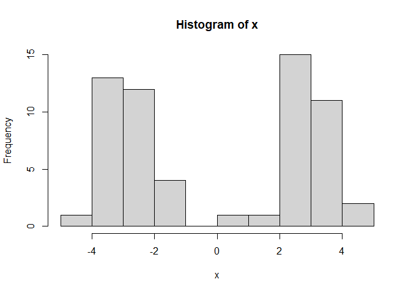
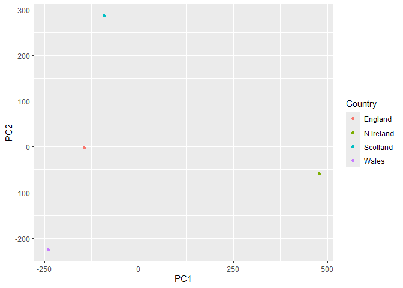
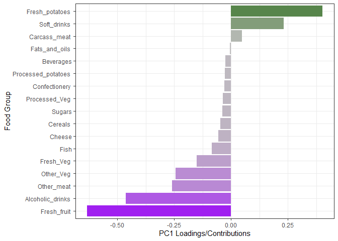
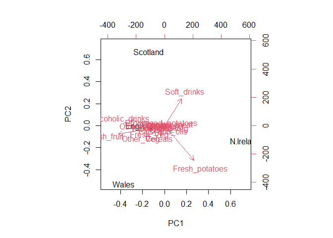
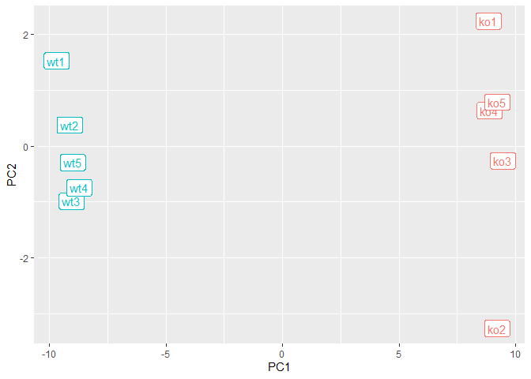

# Class 7: Machine Learning I
Nataliana Hernandez PID: A17096549

Today we are going to learn how to apply different machine learning
methods, beginning with clustering:

The goal here is to find groups/clusters in your input data.

First I will make up some data with clear groups. For this I will use
the `rnorm()` function:

``` r
rnorm(10)
```

     [1] -1.3362861 -0.4309421  1.3072428 -2.1212908  1.3597371 -0.1349395
     [7]  0.8505756 -1.4410596  3.4738343 -0.4904909

``` r
hist( rnorm(10000, mean=3))
```


Center of distribution at 0, change mean to 3 for the center to move.
Change the spread using the sd= portion of the rnorm function

``` r
hist( c(rnorm(10000, -3),
        rnorm(10000, 3)))
```


``` r
n <- 10000
x <- c(rnorm(n, -3), rnorm(n, 3))
hist(x)
```


``` r
n <- 30
x <- c(rnorm(n, -3), rnorm(n, +3))
hist(x)
```



``` r
n <- 30
x <- c(rnorm(n, -3), rnorm(n, +3))
y <- rev(x)

z <- cbind(x, y)
head(z)
```

                 x        y
    [1,] -2.455186 3.345005
    [2,] -2.015701 3.841902
    [3,] -1.525590 2.887368
    [4,] -3.317739 4.105684
    [5,] -2.645385 2.600734
    [6,] -2.904749 3.608385

``` r
plot(z)
```


Use the `kmeans()` function setting k to 2 and nstar=20

Inspect/print the results

> Q. How many points are in each cluster?

> Q. What ‘component’ of your result object details - cluster size? -
> cluster assignmnet/membership? - cluster center?

> Q. Plot x colored by kmeans cluster assignment and add cluster centers
> as blue points

``` r
km <- kmeans(z, centers = 2)
km
```

    K-means clustering with 2 clusters of sizes 30, 30

    Cluster means:
              x         y
    1  3.213355 -3.067078
    2 -3.067078  3.213355

    Clustering vector:
     [1] 2 2 2 2 2 2 2 2 2 2 2 2 2 2 2 2 2 2 2 2 2 2 2 2 2 2 2 2 2 2 1 1 1 1 1 1 1 1
    [39] 1 1 1 1 1 1 1 1 1 1 1 1 1 1 1 1 1 1 1 1 1 1

    Within cluster sum of squares by cluster:
    [1] 63.75932 63.75932
     (between_SS / total_SS =  90.3 %)

    Available components:

    [1] "cluster"      "centers"      "totss"        "withinss"     "tot.withinss"
    [6] "betweenss"    "size"         "iter"         "ifault"      

Results in kmeans object `km`

``` r
attributes(km)
```

    $names
    [1] "cluster"      "centers"      "totss"        "withinss"     "tot.withinss"
    [6] "betweenss"    "size"         "iter"         "ifault"      

    $class
    [1] "kmeans"

cluster size?

``` r
km$size
```

    [1] 30 30

cluster assignment/membership?

``` r
km$cluster
```

     [1] 2 2 2 2 2 2 2 2 2 2 2 2 2 2 2 2 2 2 2 2 2 2 2 2 2 2 2 2 2 2 1 1 1 1 1 1 1 1
    [39] 1 1 1 1 1 1 1 1 1 1 1 1 1 1 1 1 1 1 1 1 1 1

cluster center?

``` r
km$centers
```

              x         y
    1  3.213355 -3.067078
    2 -3.067078  3.213355

> Q. Plot z colored by the kmeans cluster assignment and add cluster
> centers as blue points

``` r
plot(z, col="red")
```


R will re-cycle the shorter color vector to be the same length as the
longer (number of data points) in z

``` r
plot(z, col=c("red", "blue"))
```


``` r
plot(z, col=c(1,2))
```


``` r
plot(z, col=km$cluster)
```


``` r
plot(z, col=km$cluster)
points(km$centers, col="blue", pch=15, cex=3)
```


> Q. Can you run kmeans and ask for 4 clusters please and plot the
> results like we have done above?

``` r
km4 <- kmeans(z, centers = 4)
plot(z, col=km4$cluster)
points(km4$centers, col="blue", pch=15, cex=1.5)
```


## Hierarchial Clustering

Let’s take our same made-up data `z` and see how hclust works

First we need a distance matrix of our data to be clustered.

``` r
d <- dist(z)
hc <- hclust(d)
hc
```


    Call:
    hclust(d = d)

    Cluster method   : complete 
    Distance         : euclidean 
    Number of objects: 60 

``` r
plot(hc)
abline(h=8, col="red")
```


I can get my cluster membership vector by “cutting the tree” with the
`cutree()` function like so:

``` r
grps <- cutree(hc, h=8)
grps
```

     [1] 1 1 1 1 1 1 1 1 1 1 1 1 1 1 1 1 1 1 1 1 1 1 1 1 1 1 1 1 1 1 2 2 2 2 2 2 2 2
    [39] 2 2 2 2 2 2 2 2 2 2 2 2 2 2 2 2 2 2 2 2 2 2

Can you plot `z` colored by our hclust results:

``` r
plot(z, col=grps)
```


## PCA of UK food data

Read data from the UK on food consumption in different parts of the UK

> Q1. How many rows and columns are in your new data frame named x? What
> R functions could you use to answer this questions?

``` r
url <- "https://tinyurl.com/UK-foods"
x <- read.csv(url)
head(x)
```

                   X England Wales Scotland N.Ireland
    1         Cheese     105   103      103        66
    2  Carcass_meat      245   227      242       267
    3    Other_meat      685   803      750       586
    4           Fish     147   160      122        93
    5 Fats_and_oils      193   235      184       209
    6         Sugars     156   175      147       139

``` r
dim(x)
```

    [1] 17  5

``` r
View(x)
```

# Note how the minus indexing works

``` r
rownames(x) <- x[,1]
x <- x[,-1]
head(x)
```

                   England Wales Scotland N.Ireland
    Cheese             105   103      103        66
    Carcass_meat       245   227      242       267
    Other_meat         685   803      750       586
    Fish               147   160      122        93
    Fats_and_oils      193   235      184       209
    Sugars             156   175      147       139

``` r
dim(x)
```

    [1] 17  4

Alternate approach:

``` r
x <- read.csv(url, row.names=1)
head(x)
```

                   England Wales Scotland N.Ireland
    Cheese             105   103      103        66
    Carcass_meat       245   227      242       267
    Other_meat         685   803      750       586
    Fish               147   160      122        93
    Fats_and_oils      193   235      184       209
    Sugars             156   175      147       139

> Q2. Which approach to solving the ‘row-names problem’ mentioned above
> do you prefer and why? Is one approach more robust than another under
> certain circumstances?

The second option with read.csv is better because if the first option
with x \<- x\[,-1\] is read multiple times it subtracts/shift the
columns each time until there are not enough dimensions.

``` r
barplot(as.matrix(x), beside=T, col=rainbow(nrow(x)))
```


> Q3: Changing what optional argument in the above barplot() function
> results in the following plot?

``` r
barplot(as.matrix(x), beside=F, col=rainbow(nrow(x)))
```


Changing the statement of beside from T (true) to F (false),

> Q5: Generating all pairwise plots may help somewhat. Can you make
> sense of the following code and resulting figure? What does it mean if
> a given point lies on the diagonal for a given plot?

- If a given point lies on the diagonal then it’s the same number for
  both countries/data
- It’s hard to see structure and trends in even this small dataset. How
  will we ever do this when we have big datasets with 1,000s or 10s of
  thousands of things we are measuring…

A so-called “Pairs” plot can be useful for small datasets like this one

``` r
pairs(x, col=rainbow(10), pch=16)
```


## PCA to the rescue

Let’s see how PCA deals with this dataset. So main function in base R to
do PCA is called `prcomp()`

> Q6. What is the main differences between N. Ireland and the other
> countries of the UK in terms of this data-set?

- Other_meats, fresh_potatoes, and fresh_fruits are the main differences

> Q7. Complete the code below to generate a plot of PC1 vs PC2. The
> second line adds text labels over the data points.

``` r
# Use the prcomp() PCA function 
pca <- prcomp( t(x) )
summary(pca)
```

    Importance of components:
                                PC1      PC2      PC3       PC4
    Standard deviation     324.1502 212.7478 73.87622 3.176e-14
    Proportion of Variance   0.6744   0.2905  0.03503 0.000e+00
    Cumulative Proportion    0.6744   0.9650  1.00000 1.000e+00

``` r
# Plot PC1 vs PC2
plot(pca$x[, 1], pca$x[, 2], xlab="PC1", ylab="PC2", xlim=c(-270, 500))
text(pca$x[, 1], pca$x[, 2], colnames(x))
```


> Q8. Customize your plot so that the colors of the country names match
> the colors in our UK and Ireland map and table at start of this
> document.

``` r
country.colors <- c("England" = "orange", "Wales" = "red", "Scotland" = "blue", "N.Ireland" = "green")

colors <- country.colors[match(colnames(x), names(country.colors))]

plot(pca$x[, 1], pca$x[, 2], xlab="PC1", ylab="PC2", xlim=c(-270, 500))
text(pca$x[, 1], pca$x[, 2], colnames(x), col = colors)
```


``` r
v <- round( pca$sdev^2/sum(pca$sdev^2) * 100 )
v
```

    [1] 67 29  4  0

``` r
## or the second row here...
z <- summary(pca)
z$importance
```

                                 PC1       PC2      PC3          PC4
    Standard deviation     324.15019 212.74780 73.87622 3.175833e-14
    Proportion of Variance   0.67444   0.29052  0.03503 0.000000e+00
    Cumulative Proportion    0.67444   0.96497  1.00000 1.000000e+00

``` r
barplot(v, xlab="Principal Component", ylab="Percent Variation")
```


``` r
## Lets focus on PC1 as it accounts for > 90% of variance 
par(mar=c(10, 3, 0.35, 0))
barplot( pca$rotation[,1], las=2 )
```


> Q9: Generate a similar ‘loadings plot’ for PC2. What two food groups
> feature prominantely and what does PC2 maninly tell us about?

``` r
par(mar=c(10, 3, 0.35, 0))
barplot(pca$rotation[, 2], las=2)
```


- The two food groups that feature predominantly are Fresh_potatoes and
  Soft_drinks
- PC2 mainly tells us about how Scotland compares to the other
  countries, since they drink the most soft drinks but don’t eat a lot
  of fresh potatoes.

## Using ggplot for these figures

``` r
library(ggplot2)

df <- as.data.frame(pca$x)
df_lab <- tibble::rownames_to_column(df, "Country")

# Our first basic plot
ggplot(df_lab) + 
  aes(PC1, PC2, col=Country) + 
  geom_point()
```



``` r
ggplot(df_lab) + 
  aes(PC1, PC2, col=Country, label=Country) + 
  geom_hline(yintercept = 0, col="gray") +
  geom_vline(xintercept = 0, col="gray") +
  geom_point(show.legend = FALSE) +
  geom_label(hjust=1, nudge_x = -10, show.legend = FALSE) +
  expand_limits(x = c(-300,500)) +
  xlab("PC1 (67.4%)") +
  ylab("PC2 (28%)") +
  theme_bw()
```


``` r
ld <- as.data.frame(pca$rotation)
ld_lab <- tibble::rownames_to_column(ld, "Food")

ggplot(ld_lab) +
  aes(PC1, Food) +
  geom_col()
```


``` r
ggplot(ld_lab) +
  aes(PC1, reorder(Food, PC1), bg=PC1) +
  geom_col() + 
  xlab("PC1 Loadings/Contributions") +
  ylab("Food Group") +
  scale_fill_gradient2(low="purple", mid="gray", high="darkgreen", guide=NULL) +
  theme_bw()
```



## Biplots

``` r
## The inbuilt biplot() can be useful for small datasets 
biplot(pca)
```



## PCA of RNA-seq data

``` r
url2 <- "https://tinyurl.com/expression-CSV"
rna.data <- read.csv(url2, row.names=1)
head(rna.data)
```

           wt1 wt2  wt3  wt4 wt5 ko1 ko2 ko3 ko4 ko5
    gene1  439 458  408  429 420  90  88  86  90  93
    gene2  219 200  204  210 187 427 423 434 433 426
    gene3 1006 989 1030 1017 973 252 237 238 226 210
    gene4  783 792  829  856 760 849 856 835 885 894
    gene5  181 249  204  244 225 277 305 272 270 279
    gene6  460 502  491  491 493 612 594 577 618 638

> Q10: How many genes and samples are in this data set?

- There are 6 genes and 10 samples

``` r
## Again we have to take the transpose of our data 
pca <- prcomp(t(rna.data), scale=TRUE)
 
## Simple un polished plot of pc1 and pc2
plot(pca$x[,1], pca$x[,2], xlab="PC1", ylab="PC2")
```


``` r
summary(pca)
```

    Importance of components:
                              PC1    PC2     PC3     PC4     PC5     PC6     PC7
    Standard deviation     9.6237 1.5198 1.05787 1.05203 0.88062 0.82545 0.80111
    Proportion of Variance 0.9262 0.0231 0.01119 0.01107 0.00775 0.00681 0.00642
    Cumulative Proportion  0.9262 0.9493 0.96045 0.97152 0.97928 0.98609 0.99251
                               PC8     PC9      PC10
    Standard deviation     0.62065 0.60342 3.457e-15
    Proportion of Variance 0.00385 0.00364 0.000e+00
    Cumulative Proportion  0.99636 1.00000 1.000e+00

``` r
plot(pca, main="Quick scree plot")
```


``` r
## Variance captured per PC 
pca.var <- pca$sdev^2

## Percent variance is often more informative to look at 
pca.var.per <- round(pca.var/sum(pca.var)*100, 1)
pca.var.per
```

     [1] 92.6  2.3  1.1  1.1  0.8  0.7  0.6  0.4  0.4  0.0

``` r
barplot(pca.var.per, main="Scree Plot", 
        names.arg = paste0("PC", 1:10),
        xlab="Principal Component", ylab="Percent Variation")
```


``` r
## A vector of colors for wt and ko samples
colvec <- colnames(rna.data)
colvec[grep("wt", colvec)] <- "red"
colvec[grep("ko", colvec)] <- "blue"

plot(pca$x[,1], pca$x[,2], col=colvec, pch=16,
     xlab=paste0("PC1 (", pca.var.per[1], "%)"),
     ylab=paste0("PC2 (", pca.var.per[2], "%)"))

text(pca$x[,1], pca$x[,2], labels = colnames(rna.data), pos=c(rep(4,5), rep(2,5)))
```


``` r
library(ggplot2)

df <- as.data.frame(pca$x)

# Our first basic plot
ggplot(df) + 
  aes(PC1, PC2) + 
  geom_point()
```


``` r
# Add a 'wt' and 'ko' "condition" column
df$samples <- colnames(rna.data) 
df$condition <- substr(colnames(rna.data),1,2)

p <- ggplot(df) + 
        aes(PC1, PC2, label=samples, col=condition) + 
        geom_label(show.legend = FALSE)
p
```



``` r
p + labs(title="PCA of RNASeq Data",
       subtitle = "PC1 clealy seperates wild-type from knock-out samples",
       x=paste0("PC1 (", pca.var.per[1], "%)"),
       y=paste0("PC2 (", pca.var.per[2], "%)"),
       caption="Class example data") +
     theme_bw()
```


