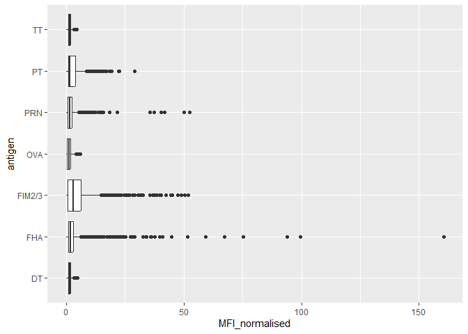

# Class 15: Pertussis and the CMI-PB project
Nataliana (PID: A17096549)

## Background

Pertussis, a.k.a whooping cough, is a highly infectious lung disease
caused by the bacteria *B. Pertussis*

The CDC tracks pertussis case numbers per year. Lets have a closer look
at this data:

[CDC
data](https://www.cdc.gov/pertussis/php/surveillance/pertussis-cases-by-year.html?CDC_AAref_Val=https://www.cdc.gov/pertussis/surv-reporting/cases-by-year.html)

We will use the **datapasta** R package to “scrape” this data into R.

> Q1. With the help of the R “addin” package datapasta assign the CDC
> pertussis case number data to a data frame called cdc and use ggplot
> to make a plot of cases numbers over time.

``` r
cdc <- data.frame(
                                 year = c(1922L,1923L,1924L,1925L,
                                          1926L,1927L,1928L,1929L,1930L,1931L,
                                          1932L,1933L,1934L,1935L,1936L,
                                          1937L,1938L,1939L,1940L,1941L,1942L,
                                          1943L,1944L,1945L,1946L,1947L,
                                          1948L,1949L,1950L,1951L,1952L,
                                          1953L,1954L,1955L,1956L,1957L,1958L,
                                          1959L,1960L,1961L,1962L,1963L,
                                          1964L,1965L,1966L,1967L,1968L,1969L,
                                          1970L,1971L,1972L,1973L,1974L,
                                          1975L,1976L,1977L,1978L,1979L,1980L,
                                          1981L,1982L,1983L,1984L,1985L,
                                          1986L,1987L,1988L,1989L,1990L,
                                          1991L,1992L,1993L,1994L,1995L,1996L,
                                          1997L,1998L,1999L,2000L,2001L,
                                          2002L,2003L,2004L,2005L,2006L,2007L,
                                          2008L,2009L,2010L,2011L,2012L,     
                                          2013L,2014L,2015L,2016L,2017L,2018L,
                                          2019L,2020L,2021L,2022L),
                                cases = c(107473,164191,165418,152003,
                                          202210,181411,161799,197371,
                                          166914,172559,215343,179135,265269,
                                          180518,147237,214652,227319,103188,
                                          183866,222202,191383,191890,109873,
                                          133792,109860,156517,74715,69479,
                                          120718,68687,45030,37129,60886,
                                          62786,31732,28295,32148,40005,
                                          14809,11468,17749,17135,13005,6799,
                                          7717,9718,4810,3285,4249,3036,
                                          3287,1759,2402,1738,1010,2177,2063,
                                          1623,1730,1248,1895,2463,2276,
                                          3589,4195,2823,3450,4157,4570,
                                          2719,4083,6586,4617,5137,7796,6564,
                                          7405,7298,7867,7580,9771,11647,
                                          25827,25616,15632,10454,13278,
                                          16858,27550,18719,48277,28639,32971,
                                          20762,17972,18975,15609,18617,6124,
                                          2116,3044)
       )
```

``` r
library(ggplot2)

baseplot <- ggplot(cdc) +
  aes(year,cases) +
  geom_point() +
  geom_line()

baseplot
```


Add some landmark developments as annotation to our plot. We will
inlcude the first whole-cell (wP) vaccine roll-out in 1947.

Let’s add the switch to acellular vaccine (aP) in 1996.

> > Q2. Using the ggplot geom_vline() function add lines to your
> > previous plot for the 1946 introduction of the wP vaccine and the
> > 1996 switch to aP vaccine (see example in the hint below). What do
> > you notice?

``` r
baseplot +
  geom_vline(xintercept=1946, col="blue") +
  geom_vline(xintercept=1995, col="red") +
  geom_vline(xintercept=2020, col="green") +
  geom_vline(xintercept=2003, col="purple") 
```


> Q3. Describe what happened after the introduction of the aP vaccine?
> Do you have a possible explanation for the observed trend?

- After the introduction of the aP vaccine, cases began to increase
  around the 2000s and 2010s.
- There is ~10 year lag from aP roll out to increasing case numbers.
  This holds true of other countries like Japan, UK, etc.
- We went from ~200,000 cases pre wP vaccine to ~1,000 cases in 1976.
  The US switched to the aP vaccine in 1995. We start to see a big
  increase in 2004 to ~26,000 cases.

**Key question**: Why does the aP vaccine induce immunity wane faster
than that of the wP vaccine?

## CMI-PB

The CMI-PB (Computational Models of Immunity Pertussis Boost) makes
available lots of data about the immune response to Pertussis booster
vaccination.

Critically, it tracks wP and aP individuals over time to see how their
immune response changes.

CMI-PB make all their data freely available via JSON format tables from
their database.

Let’s read the first one of these tables:

``` r
# Allows us to read, write and process JSON data
library(jsonlite)
```

``` r
subject <- read_json("https://www.cmi-pb.org/api/subject", simplifyVector = TRUE) 
```

``` r
head(subject)
```

      subject_id infancy_vac biological_sex              ethnicity  race
    1          1          wP         Female Not Hispanic or Latino White
    2          2          wP         Female Not Hispanic or Latino White
    3          3          wP         Female                Unknown White
    4          4          wP           Male Not Hispanic or Latino Asian
    5          5          wP           Male Not Hispanic or Latino Asian
    6          6          wP         Female Not Hispanic or Latino White
      year_of_birth date_of_boost      dataset
    1    1986-01-01    2016-09-12 2020_dataset
    2    1968-01-01    2019-01-28 2020_dataset
    3    1983-01-01    2016-10-10 2020_dataset
    4    1988-01-01    2016-08-29 2020_dataset
    5    1991-01-01    2016-08-29 2020_dataset
    6    1988-01-01    2016-10-10 2020_dataset

> Q. How many subjects are there in this database?

``` r
nrow(subject)
```

    [1] 172

> Q4. How many aP and wP infancy vaccinated subjects are in the dataset?

``` r
table(subject$infancy_vac)
```


    aP wP 
    87 85 

> Q5. How many Male and Female subjects/patients are in the dataset?

``` r
table(subject$biological_sex)
```


    Female   Male 
       112     60 

> Q6. What is the breakdown of race and biological sex (e.g. number of
> Asian females, White males etc…)?

``` r
table(subject$race, subject$biological_sex)
```

                                               
                                                Female Male
      American Indian/Alaska Native                  0    1
      Asian                                         32   12
      Black or African American                      2    3
      More Than One Race                            15    4
      Native Hawaiian or Other Pacific Islander      1    1
      Unknown or Not Reported                       14    7
      White                                         48   32

> Q. Does this do a good job of representing the US populus?

- No since it does not represent the population groups well since
  certain races and genders are skewed.

``` r
library(lubridate)
```


    Attaching package: 'lubridate'

    The following objects are masked from 'package:base':

        date, intersect, setdiff, union

``` r
today()
```

    [1] "2024-12-07"

``` r
today() - ymd("2000-01-01")
```

    Time difference of 9107 days

``` r
time_length( today() - ymd("2000-01-01"),  "years")
```

    [1] 24.93361

> Q7. Using this approach determine (i) the average age of wP
> individuals, (ii) the average age of aP individuals; and (iii) are
> they significantly different?

``` r
# Use todays date to calculate age in days
subject$age <- today() - ymd(subject$year_of_birth)

library(dplyr)
```


    Attaching package: 'dplyr'

    The following objects are masked from 'package:stats':

        filter, lag

    The following objects are masked from 'package:base':

        intersect, setdiff, setequal, union

``` r
ap <- subject %>% filter(infancy_vac == "aP")

round( summary( time_length( ap$age, "years" ) ) )
```

       Min. 1st Qu.  Median    Mean 3rd Qu.    Max. 
         22      26      27      27      28      34 

``` r
# wP
wp <- subject %>% filter(infancy_vac == "wP")
round( summary( time_length( wp$age, "years" ) ) )
```

       Min. 1st Qu.  Median    Mean 3rd Qu.    Max. 
         22      32      34      36      39      57 

- Yes, they are significantly different based on the means and medians.
  Additionally, a p-test can be done as seen later with the histological
  plot.

> Q8. Determine the age of all individuals at time of boost?

``` r
int <- ymd(subject$date_of_boost) - ymd(subject$year_of_birth)
age_at_boost <- time_length(int, "year")
head(age_at_boost)
```

    [1] 30.69678 51.07461 33.77413 28.65982 25.65914 28.77481

> Q9. With the help of a faceted boxplot or histogram (see below), do
> you think these two groups are significantly different?

``` r
ggplot(subject) +
  aes(time_length(age, "year"),
      fill=as.factor(infancy_vac)) +
  geom_histogram(show.legend=FALSE) +
  facet_wrap(vars(infancy_vac), nrow=2) +
  xlab("Age in years")
```

    `stat_bin()` using `bins = 30`. Pick better value with `binwidth`.


``` r
# Or use wilcox.test() 
x <- t.test(time_length( wp$age, "years" ),
       time_length( ap$age, "years" ))

x$p.value
```

    [1] 2.372101e-23

They are significantly different based on the p-test above since the
p-value is \<0.05 then the data is significant.

``` r
# Complete the API URLs...
specimen <- read_json("https://www.cmi-pb.org/api/specimen", simplifyVector = TRUE) 
```

> Q9. Complete the code to join specimen and subject tables to make a
> new merged data frame containing all specimen records along with their
> associated subject details:

Now we can join (merge) these two tables `subject` and `specimen` to
make one new `meta` table with the combined data.

``` r
library(dplyr)

meta <- inner_join(subject, specimen)
```

    Joining with `by = join_by(subject_id)`

``` r
head(meta)
```

      subject_id infancy_vac biological_sex              ethnicity  race
    1          1          wP         Female Not Hispanic or Latino White
    2          1          wP         Female Not Hispanic or Latino White
    3          1          wP         Female Not Hispanic or Latino White
    4          1          wP         Female Not Hispanic or Latino White
    5          1          wP         Female Not Hispanic or Latino White
    6          1          wP         Female Not Hispanic or Latino White
      year_of_birth date_of_boost      dataset        age specimen_id
    1    1986-01-01    2016-09-12 2020_dataset 14220 days           1
    2    1986-01-01    2016-09-12 2020_dataset 14220 days           2
    3    1986-01-01    2016-09-12 2020_dataset 14220 days           3
    4    1986-01-01    2016-09-12 2020_dataset 14220 days           4
    5    1986-01-01    2016-09-12 2020_dataset 14220 days           5
    6    1986-01-01    2016-09-12 2020_dataset 14220 days           6
      actual_day_relative_to_boost planned_day_relative_to_boost specimen_type
    1                           -3                             0         Blood
    2                            1                             1         Blood
    3                            3                             3         Blood
    4                            7                             7         Blood
    5                           11                            14         Blood
    6                           32                            30         Blood
      visit
    1     1
    2     2
    3     3
    4     4
    5     5
    6     6

Now read an “experiment data” table from CMI-PB

``` r
abdata <- read_json("http://cmi-pb.org/api/v5/plasma_ab_titer",
                    simplifyVector = TRUE)

head(abdata)
```

      specimen_id isotype is_antigen_specific antigen        MFI MFI_normalised
    1           1     IgE               FALSE   Total 1110.21154       2.493425
    2           1     IgE               FALSE   Total 2708.91616       2.493425
    3           1     IgG                TRUE      PT   68.56614       3.736992
    4           1     IgG                TRUE     PRN  332.12718       2.602350
    5           1     IgG                TRUE     FHA 1887.12263      34.050956
    6           1     IgE                TRUE     ACT    0.10000       1.000000
       unit lower_limit_of_detection
    1 UG/ML                 2.096133
    2 IU/ML                29.170000
    3 IU/ML                 0.530000
    4 IU/ML                 6.205949
    5 IU/ML                 4.679535
    6 IU/ML                 2.816431

One more join to do of `meta` and `abdata` to associate all the metadata
about the individual and their race, biological sex, and infancy
vaccination status together with Antibody levels.

> Q10. Now using the same procedure join meta with titer data so we can
> further analyze this data in terms of time of visit aP/wP, male/female
> etc.

``` r
ab <- inner_join(abdata, meta)
```

    Joining with `by = join_by(specimen_id)`

``` r
head(ab)
```

      specimen_id isotype is_antigen_specific antigen        MFI MFI_normalised
    1           1     IgE               FALSE   Total 1110.21154       2.493425
    2           1     IgE               FALSE   Total 2708.91616       2.493425
    3           1     IgG                TRUE      PT   68.56614       3.736992
    4           1     IgG                TRUE     PRN  332.12718       2.602350
    5           1     IgG                TRUE     FHA 1887.12263      34.050956
    6           1     IgE                TRUE     ACT    0.10000       1.000000
       unit lower_limit_of_detection subject_id infancy_vac biological_sex
    1 UG/ML                 2.096133          1          wP         Female
    2 IU/ML                29.170000          1          wP         Female
    3 IU/ML                 0.530000          1          wP         Female
    4 IU/ML                 6.205949          1          wP         Female
    5 IU/ML                 4.679535          1          wP         Female
    6 IU/ML                 2.816431          1          wP         Female
                   ethnicity  race year_of_birth date_of_boost      dataset
    1 Not Hispanic or Latino White    1986-01-01    2016-09-12 2020_dataset
    2 Not Hispanic or Latino White    1986-01-01    2016-09-12 2020_dataset
    3 Not Hispanic or Latino White    1986-01-01    2016-09-12 2020_dataset
    4 Not Hispanic or Latino White    1986-01-01    2016-09-12 2020_dataset
    5 Not Hispanic or Latino White    1986-01-01    2016-09-12 2020_dataset
    6 Not Hispanic or Latino White    1986-01-01    2016-09-12 2020_dataset
             age actual_day_relative_to_boost planned_day_relative_to_boost
    1 14220 days                           -3                             0
    2 14220 days                           -3                             0
    3 14220 days                           -3                             0
    4 14220 days                           -3                             0
    5 14220 days                           -3                             0
    6 14220 days                           -3                             0
      specimen_type visit
    1         Blood     1
    2         Blood     1
    3         Blood     1
    4         Blood     1
    5         Blood     1
    6         Blood     1

> Q. How many Ab measurements do we have?

``` r
nrow(ab)
```

    [1] 52576

> Q11. How many specimens (i.e. entries in abdata) do we have for each
> isotype?

``` r
table(ab$isotype)
```


      IgE   IgG  IgG1  IgG2  IgG3  IgG4 
     6698  5389 10117 10124 10124 10124 

> Q12. What are the different \$dataset values in abdata and what do you
> notice about the number of rows for the most “recent” dataset?

``` r
table(ab$antigen)
```


        ACT   BETV1      DT   FELD1     FHA  FIM2/3   LOLP1     LOS Measles     OVA 
       1970    1970    4978    1970    5372    4978    1970    1970    1970    4978 
        PD1     PRN      PT     PTM   Total      TT 
       1970    5372    5372    1970     788    4978 

Let’s focus in on IgG - one of the main antibody types responsive to
bacteria or viral infections

## IgG Ab titer levels

> Q13. Complete the following code to make a summary boxplot of Ab titer
> levels (MFI) for all antigens:

``` r
igg <- filter(ab, isotype=="IgG")
head(igg)
```

      specimen_id isotype is_antigen_specific antigen        MFI MFI_normalised
    1           1     IgG                TRUE      PT   68.56614       3.736992
    2           1     IgG                TRUE     PRN  332.12718       2.602350
    3           1     IgG                TRUE     FHA 1887.12263      34.050956
    4          19     IgG                TRUE      PT   20.11607       1.096366
    5          19     IgG                TRUE     PRN  976.67419       7.652635
    6          19     IgG                TRUE     FHA   60.76626       1.096457
       unit lower_limit_of_detection subject_id infancy_vac biological_sex
    1 IU/ML                 0.530000          1          wP         Female
    2 IU/ML                 6.205949          1          wP         Female
    3 IU/ML                 4.679535          1          wP         Female
    4 IU/ML                 0.530000          3          wP         Female
    5 IU/ML                 6.205949          3          wP         Female
    6 IU/ML                 4.679535          3          wP         Female
                   ethnicity  race year_of_birth date_of_boost      dataset
    1 Not Hispanic or Latino White    1986-01-01    2016-09-12 2020_dataset
    2 Not Hispanic or Latino White    1986-01-01    2016-09-12 2020_dataset
    3 Not Hispanic or Latino White    1986-01-01    2016-09-12 2020_dataset
    4                Unknown White    1983-01-01    2016-10-10 2020_dataset
    5                Unknown White    1983-01-01    2016-10-10 2020_dataset
    6                Unknown White    1983-01-01    2016-10-10 2020_dataset
             age actual_day_relative_to_boost planned_day_relative_to_boost
    1 14220 days                           -3                             0
    2 14220 days                           -3                             0
    3 14220 days                           -3                             0
    4 15316 days                           -3                             0
    5 15316 days                           -3                             0
    6 15316 days                           -3                             0
      specimen_type visit
    1         Blood     1
    2         Blood     1
    3         Blood     1
    4         Blood     1
    5         Blood     1
    6         Blood     1

Make a first plot of MFI (Mean Fluourescence Intensity - a measure of
how much is detected) for each antigen.

``` r
ggplot(igg) +
  aes(MFI_normalised, antigen) +
  geom_boxplot()
```



``` r
ggplot(igg) +
  aes(MFI_normalised, antigen) +
  geom_boxplot() +
xlim(0,75) +
  facet_wrap(vars(visit), nrow=2)
```

    Warning: Removed 5 rows containing non-finite outside the scale range
    (`stat_boxplot()`).


> Q14. What antigens show differences in the level of IgG antibody
> titers recognizing them over time? Why these and not others?

- PT, PRN, FIM2/3, and FHA show differences in the antibody titer
  levels. This is because they have large interquartile ranges and many
  outliers that vary between each patient.

``` r
abdata.21 <- ab %>% filter(dataset == "2021_dataset")

abdata.21 %>% 
  filter(isotype == "IgG",  antigen == "PT") %>%
  ggplot() +
    aes(x=planned_day_relative_to_boost,
        y=MFI_normalised,
        col=infancy_vac,
        group=subject_id) +
    geom_point() +
    geom_line() +
    geom_vline(xintercept=0, linetype="dashed") +
    geom_vline(xintercept=14, linetype="dashed") +
  labs(title="2021 dataset IgG PT",
       subtitle = "Dashed lines indicate day 0 (pre-boost) and 14 (apparent peak levels)")
```


